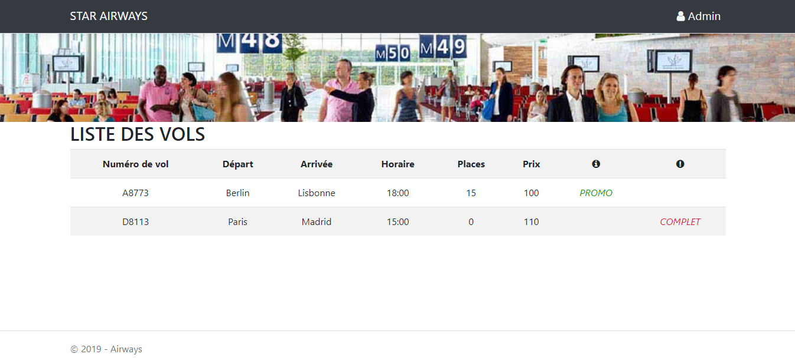

# Application web .NET Core 

## Introduction

Ceci est une application web utilisant le framework .Net Core et l'architecture MVC comprenant contrôleurs et vues.

## A propos de l'application

Cette application permet à un utilisateur de s'identifier en tant qu'admin et de pouvoir administrer la liste des vols.

> La maquette ci-dessous correspond à la page d'accueil de l'application et fait apparaître la liste des vols crée depuis l'espace administrateur. 

